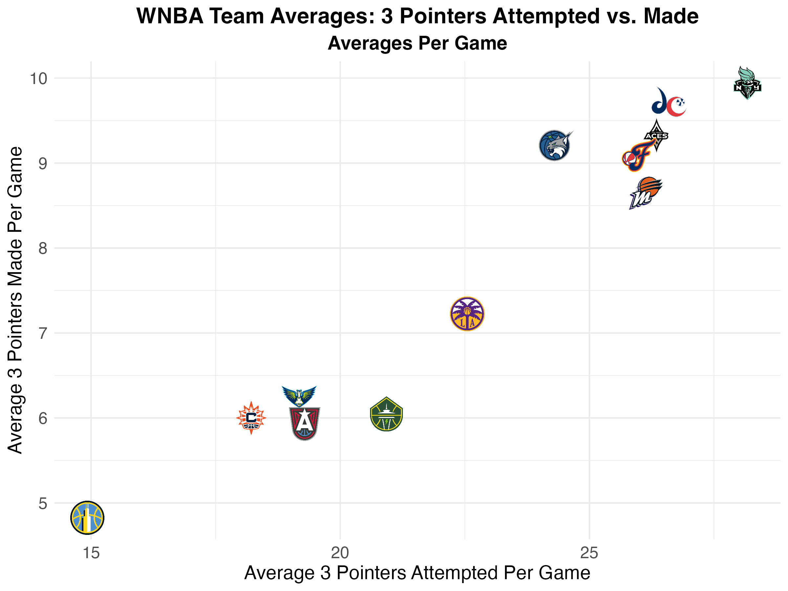
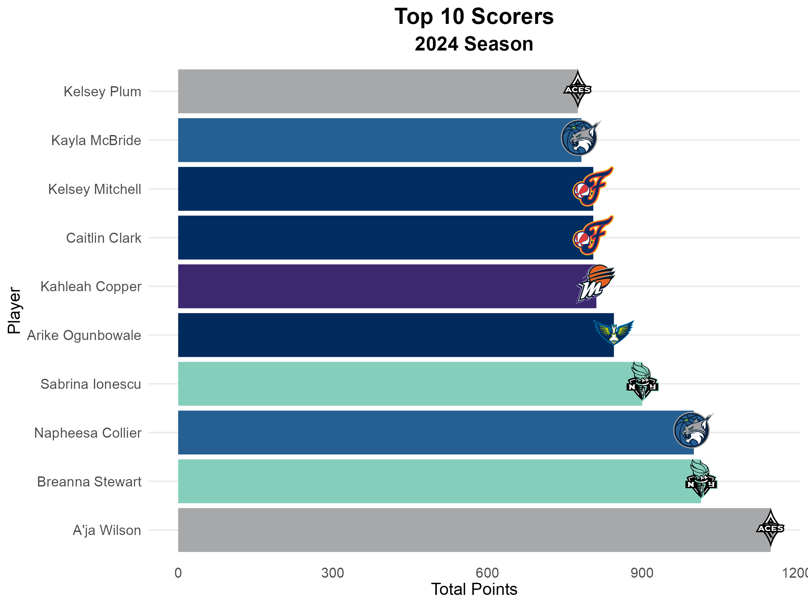
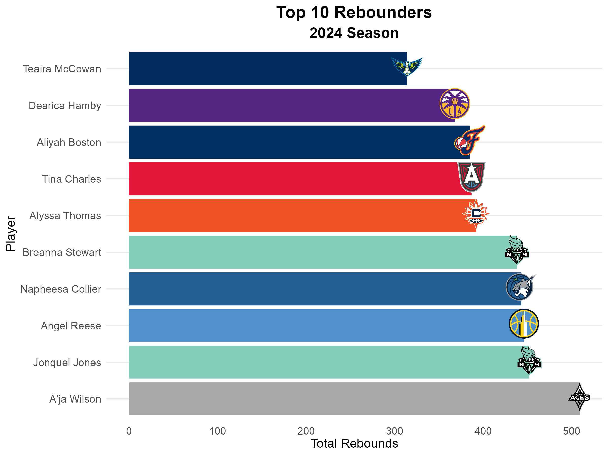
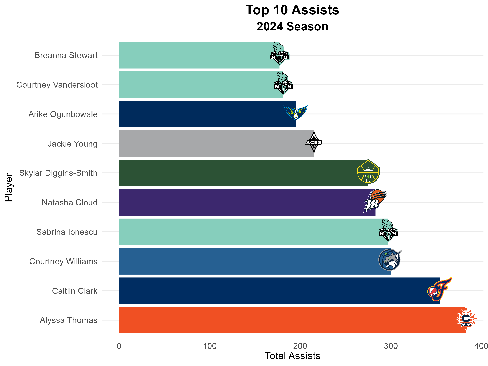

# WNBA Analysis Project

This repository contains an R script designed for analyzing WNBA statistics, generating insightful visualizations, and building predictive models based on the 2024 season data. The project utilizes data provided by the `wehoop` package, enabling advanced exploration of play-by-play data, team performance, and player contributions.

## Features

- **Data Loading**:
  - Play-by-play data
  - Team statistics
  - Player statistics
- **Data Wrangling**:
  - Creation of summarized datasets for teams and players
  - Filtering and transformation of raw data for analysis
- **Visualization**:
  - Team performance trends (e.g., scoring margins, shooting percentages)
  - Player contributions (e.g., top scorers, rebounders, and assist leaders)
  - Shot charts for individual players and teams
- **Modeling**:
  - Linear regression analysis to predict scoring margins
  - Diagnostic plots to evaluate model performance

## Visual Highlights

### Team Averages: 3 Pointers Attempted vs. Made
```r
# plotting average 3 pointers attempted vs average 3 pointers made
ggplot(teamaverages, (aes(x = avg_three_point_field_goals_attempted, y = 
                   avg_three_point_field_goals_made))) + 
  geom_image(aes(image = teamlogo), size = 0.08) + # adding team logo
  labs(
    title = "WNBA Team Averages: 3 Pointers Attempted vs. Made",
    subtitle = "Averages Per Game",
    x = "Average 3 Pointers Attempted Per Game",
    y = "Average 3 Pointers Made Per Game"
  ) + 
  theme_minimal() + # white background 
  theme( # make it stand out more to readers
    plot.title = element_text(hjust = 0.5, size = 16, face = "bold"),
    plot.subtitle = element_text(hjust = 0.5, size = 14, face = "bold"),
    axis.text = element_text(size = 12),
    axis.title = element_text(size = 14)
  )
```


### Player Contributions: Top 10 Scorers
```r
# prepare the data (extract top 10 scorers)
data <- player_contributions %>% top_n(10, total_points)
# Create the bar plot
ggplot(data, aes(x = reorder(athlete_display_name, -total_points), y = total_points)) +
  geom_bar(stat = "identity", fill = data$team_color) +
  geom_image(aes(image = team_logo), size = 0.09, by = "height", nudge_x = 0.05) +
  coord_flip() +
  labs(
    title = "Top 10 Scorers",
    subtitle = "2024 Season",
    x = "Player",
    y = "Total Points",
    fill = "Team"
  ) +
  theme_minimal() +
  theme(
    text = element_text(family = "Arial", size = 12),
    plot.title = element_text(hjust = 0.5, size = 16, face = "bold"),
    plot.subtitle = element_text(hjust = 0.5, size = 14, face = "bold"),
    axis.text.x = element_text(size = 10, angle = 0, vjust = 0.5),
    axis.text.y = element_text(size = 10),
    panel.grid.major.x = element_blank(),
    panel.grid.minor.x = element_blank()
  )
```


### Player Contributions: Top 10 Rebounders
```r
# plot top rebounders
ggplot(rebounds, aes(x = reorder(athlete_display_name, -total_rebounds), y = total_rebounds)) +
  geom_bar(stat = "identity", fill = rebounds$team_color) +
  geom_image(aes(image = team_logo), size = 0.09, by = "height", nudge_x = 0.05) +
  coord_flip() +
  labs(
    title = "Top 10 Rebounders",
    subtitle = "2024 Season",
    x = "Player",
    y = "Total Rebounds",
    fill = "Team"
  ) +
  theme_minimal() +
  theme(
    text = element_text(family = "Arial", size = 12),
    plot.title = element_text(hjust = 0.5, size = 16, face = "bold"),
    plot.subtitle = element_text(hjust = 0.5, size = 14, face = "bold"),
    axis.text.x = element_text(size = 10, angle = 0, vjust = 0.5),
    axis.text.y = element_text(size = 10),
    panel.grid.major.x = element_blank(),
    panel.grid.minor.x = element_blank()
  )
```


### Player Contributions: Top 10 Assist Leaders
```r
# plot most assists
ggplot(assists, aes(x = reorder(athlete_display_name, -total_assists), y = total_assists)) +
  geom_bar(stat = "identity", fill = assists$team_color) +
  geom_image(aes(image = team_logo), size = 0.09, by = "height", nudge_x = 0.05) +
  coord_flip() +
  labs(
    title = "Top 10 Assists",
    subtitle = "2024 Season",
    x = "Player",
    y = "Total Assists",
    fill = "Team"
  ) +
  theme_minimal() +
  theme(
    text = element_text(family = "Arial", size = 12),
    plot.title = element_text(hjust = 0.5, size = 16, face = "bold"),
    plot.subtitle = element_text(hjust = 0.5, size = 14, face = "bold"),
    axis.text.x = element_text(size = 10, angle = 0, vjust = 0.5),
    axis.text.y = element_text(size = 10),
    panel.grid.major.x = element_blank(),
    panel.grid.minor.x = element_blank()
  )
```


### Shot Charts: Indiana Fever (Home Games)
```r
# plotting Indiana Fever home games shot chart
geom_basketball(league = "wnba", color_updates = list(
  plot_background = '#ffffff'
)) + 
  geom_point(data = fever_home,
             aes(coordinate_x, coordinate_y,
                 color = scoring_play),
             size = 2.5, alpha = 0.6) + 
  scale_color_manual(values = c("TRUE" = "green", "FALSE" = "red"),
                     labels = c("Made Shot", "Missed Shot")) + 
  theme_minimal() + 
  labs(title = "Indiana Fever Shot Chart Home Games (2024)",
       subtitle = "Shot attempts colored by outcome",
       x = NULL, y = NULL, color = "Shot Outcome") +
  theme(plot.background = element_rect(fill = "white", color = "white"),  
        panel.grid = element_blank(),  
        plot.title = element_text(hjust = 0.5, face = "bold", size = 16),
        plot.subtitle = element_text(hjust = 0.5, size = 12))
```

## Requirements

The project relies on the following R packages:

- `wehoop`
- `dplyr`
- `tidyverse`
- `ggplot2`
- `ggimage`
- `sportyR`
- `grid`
- `gridExtra`

To install the required packages, use the following command:

```r
install.packages(c("wehoop", "dplyr", "tidyverse", "ggplot2", "ggimage", "sportyR", "gridExtra"))
```

## How to Use

1. Clone the repository:
   ```bash
   git clone https://github.com/keltiwise/WNBA-Analysis.git
   cd WNBA-Analysis
   ```
2. Open the `Analysis.R` script in your R environment (e.g., RStudio).
3. Run the script to:
   - Load and preprocess data
   - Generate visualizations
   - Analyze and interpret WNBA statistics

## Insights and Applications

This analysis is intended to provide:

- Insights into team and player performance during the 2024 WNBA season.
- Visual tools for evaluating trends, such as shooting efficiency and team contributions.
- A foundation for predictive modeling in sports analytics.

## Future Work

- Expand analysis to include historical WNBA data.
- Incorporate machine learning models for advanced prediction.
- Add interactive visualizations using `shiny` or other R frameworks.

## Contributing

Contributions are welcome! Feel free to open an issue or submit a pull request for improvements or new features.

## License

This project is licensed under the MIT License. See the `LICENSE` file for more details.

## Acknowledgments

- Special thanks to the creators of the `wehoop` package for making comprehensive WNBA data accessible.
- Inspired by the vibrant community of sports analysts and data scientists.

---


